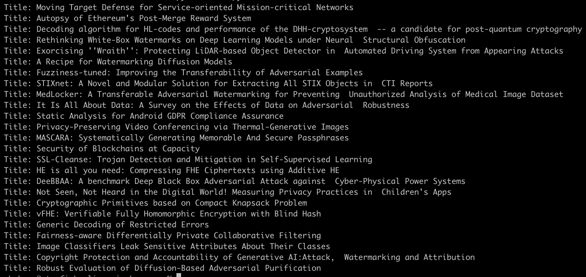

# cli-arxiv-browser
If you are like me, you enjoy browsing the [Arxiv Cryptography & Security section](https://arxiv.org/list/cs.CR/recent) to keep up with the pace of new research papers and titles that are submitted and published at Cornell University. Arxiv is a great resource for finding cutting-edge work in various fields of computer science, mathematics, physics and more.

However, sometimes I don't want to open a browser and navigate to the website. I prefer to do things from the terminal or a command-line interface (CLI), as it is faster, more convenient and more fun. That's why I wrote a quick Python script that will grab the titles of the most recent 25 published papers using [BeautifulSoup](https://www.crummy.com/software/BeautifulSoup/) and parsing the DOM.

The script is very simple and does not require any external libraries or dependencies. It just uses requests to fetch the HTML page, BeautifulSoup to parse it, and prints out the titles in a nice format. It serves the purposes for which I need it for but since I find it helpful, perhaps you will too.

You can find the repository that hosts the code at [this link](https://github.com/UX-10/cli-arxiv-browser). The script is called `cli.py` and you can run it by typing `python cli.py` in your terminal. You should see something like this:

Depending on how useful it is, other things to add would be PDF download links and pagination for the remainder of the titles. If you have any suggestions or feedback, feel free to open an issue or a pull request on GitHub.
